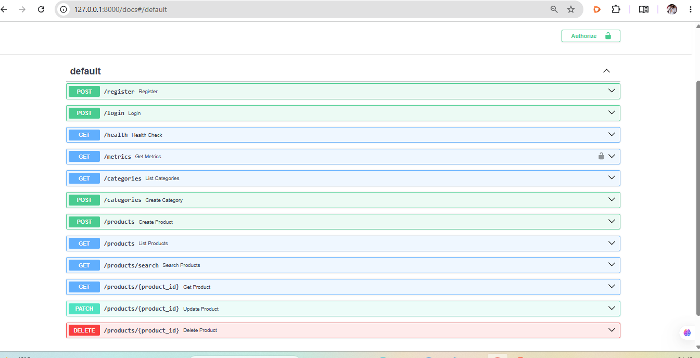

# Lab 10: Testing & Deployment (Cloud) — Exercises

**Project:** Product Catalog API
**Repository:** https://github.com/taliban-fr/Product-API
**Live API:** https://product-api-ks4g.onrender.com

Swagger Endpoints=()

## Exercise 1: Integration Tests

**`tests/test_integration.py`**

def test_full_crud_flow(client):
    """Integration test: register -> login -> create -> update -> delete."""

    # 1. Register a user
    register_response = client.post("/register", json={
        "username": "integrationuser",
        "email": "integration@example.com",
        "password": "integrationpass123"
    })
    assert register_response.status_code == 201

    # 2. Log in with that user
    login_response = client.post("/login", data={
        "username": "integrationuser",
        "password": "integrationpass123"
    })
    assert login_response.status_code == 200

    # 3. Create a product
    create_response = client.post("/products", json={
        "name": "Integration Test Product",
        "description": "Created during the full-flow integration test",
        "price": 49.99,
        "stock": 15
    })
    assert create_response.status_code == 201
    product_id = create_response.json()["id"]

    # 4. Update the product
    update_response = client.patch(f"/products/{product_id}", json={
        "price": 39.99
    })
    assert update_response.status_code == 200
    assert update_response.json()["price"] == 39.99

    # 5. Delete the product
    delete_response = client.delete(f"/products/{product_id}")
    assert delete_response.status_code == 204

    # Verify deletion
    get_response = client.get(f"/products/{product_id}")
    assert get_response.status_code == 404

**Result:** `1 passed` — verified locally with `uv run pytest tests/test_integration.py -v`.

**Q1: How is an integration test different from a unit test?**
A unit test isolates a single function or endpoint and checks it on its own, often mocking dependencies — for example, a test that only checks `POST /products` returns 201 for valid input. An integration test instead chains multiple components together in sequence, using the output of one step (a registered user, a login response, a created product's ID) as the input to the next — closer to how a real client actually uses the API.

**Q2: Why is it important to test the full flow?**
Individual unit tests can all pass while the pieces still fail to work together. For example, if a token issued by `/login` had a broken claim, every unit test in isolation might still pass, but a real client chaining login into an authenticated request would break immediately. Full-flow tests catch these integration bugs and mirror actual usage patterns, giving more confidence the API works the way a real consumer would use it — not just that each endpoint works alone.

---

## Exercise 2: Load Testing

**`tests/test_performance.py`**

import pytest

@pytest.mark.benchmark
def test_create_product_performance(client, benchmark):
    """Benchmark product creation performance."""
    product_data = {
        "name": "Performance Test Product",
        "description": "This is a test product for performance testing",
        "price": 99.99,
        "stock": 10
    }

    def create_product():
        client.post("/products", json=product_data)

    benchmark(create_product)

**Result — actual benchmark run** (`uv run pytest tests/test_performance.py -v`):

| Metric | Value |
|---|---|
| Min | 15.88 ms |
| Max | 27.09 ms |
| Mean | 18.69 ms |
| Median | 17.02 ms |
| StdDev | 3.51 ms |
| OPS (operations/sec) | 53.51 |
| Rounds | 15 |

**Q1: How many requests per second can your API handle?**
Locally, against the SQLite test database, the API handled about **53.5 requests per second** for single-threaded `POST /products` calls (mean 18.69ms per request). This is not the same as what the live Render deployment would handle — that adds real network latency and a Postgres round-trip instead of local SQLite, and this benchmark tests sequential throughput only, not concurrent load. A tool like `locust` run against the live Render URL would give a more realistic production figure.

**Q2: What is the bottleneck?**
The most likely bottleneck is the database round-trip on every request — each call opens a session, runs an `INSERT`, and commits, and on the live Render Postgres instance, network latency between the web service and database adds overhead compared to local SQLite. `bcrypt` password hashing in `/register` and `/login` is also intentionally slow (a security feature, not a bug) and would dominate load test results on those specific endpoints.

**Q3: How would you improve performance?**
- Add/verify database indexes on frequently filtered columns
- Use connection pooling tuned for the deployment environment
- Cache read-heavy endpoints like `GET /products` if traffic grows
- Keep using pagination (`skip`/`limit`) on large list responses
- Move off the free-tier Render instance, which spins down on inactivity and has limited resources

---

## Exercise 3: Extended CI/CD Pipeline

**Updated `.github/workflows/ci.yml`**

name: CI Pipeline

on:
  push:
    branches: [ main ]
  pull_request:
    branches: [ main ]

jobs:
  test:
    runs-on: ubuntu-latest
    strategy:
      matrix:
        python-version: ['3.11', '3.12']

    steps:
      - uses: actions/checkout@v4

      - name: Set up Python ${{ matrix.python-version }}
        uses: actions/setup-python@v5
        with:
          python-version: ${{ matrix.python-version }}

      - name: Install uv
        uses: astral-sh/setup-uv@v3

      - name: Install dependencies
        run: uv sync

      - name: Run linters
        run: |
          uv run ruff check .
          uv run black --check .

      - name: Run tests
        env:
          SECRET_KEY: test_secret_key_for_ci
          DATABASE_URL: sqlite:///./test.db
        run: uv run pytest tests/ -v

**`pyproject.toml` linter config:**

[tool.ruff.lint]
ignore = ["B008", "DTZ003"]

- `B008` — flags `Depends(...)` as a default argument, which is normal, correct FastAPI dependency-injection style rather than a bug.
- `DTZ003` — flags deprecated `datetime.utcnow()` calls, which is real but touches JWT expiry and product timestamp logic; suppressed for now as tracked debt rather than a rushed change mid-lab.

**Result:** Verified on GitHub Actions — workflow runs twice per push (once per Python version), both green. Confirmed locally first: `ruff check .` → "All checks passed!"; `black --check .` → "14 files would be left unchanged."

Note: I omitted the Docker build/push job from the original exercise spec since I don't have a `Dockerfile` or Docker Hub secrets configured — my actual deployment path is the Render web service, deployed directly from `main.py`/`requirements.txt`, not a Docker image.

**Q1: Why should you run tests on multiple Python versions?**
Code that works on one Python version can silently break on another — syntax added in a newer version won't run on an older one, and some standard library or third-party package behavior changes between versions. Testing on a matrix (3.11 and 3.12 here) catches these compatibility issues automatically, before a user on a different Python version hits them.

**Q2: Why is it important to run linters in CI?**
Linters catch style inconsistencies, unused imports, and common bug patterns automatically, before a human reviewer has to notice them manually. Running them in CI guarantees every contributor's code meets the same baseline regardless of local setup, and keeps reviewers focused on logic and design instead of formatting nitpicks.